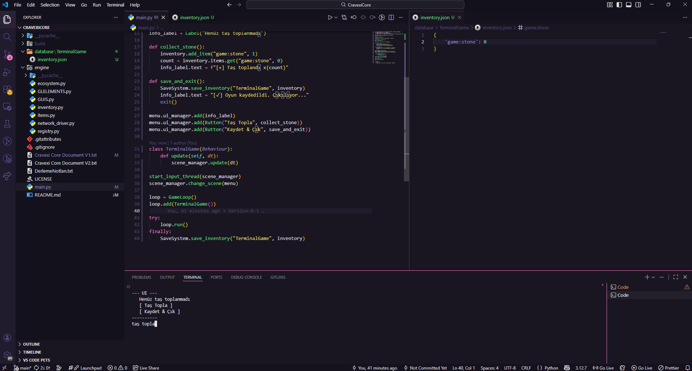
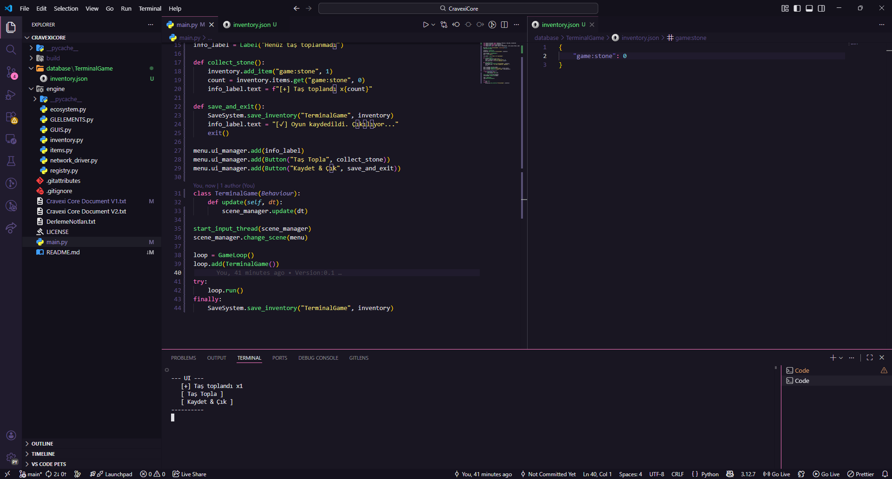
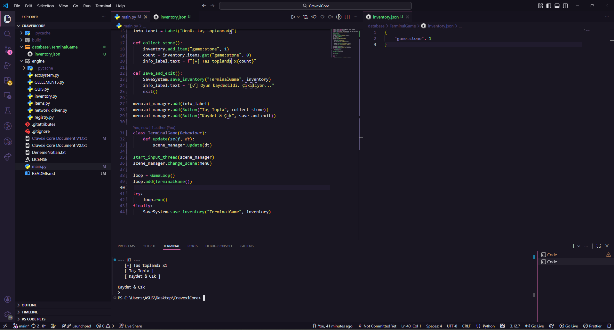
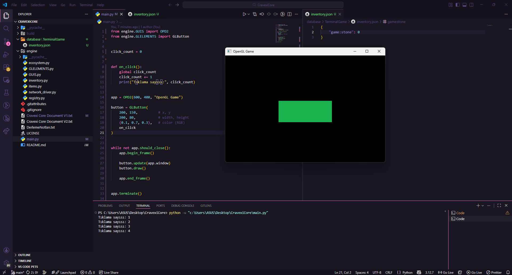

# ENGLISH

# 🛠️ CRAVEXI CORE — Game Engine

CravexiCore is a Python-based **high-performance Terminal (CLI)** game and **modern OpenGL (GUI)** application hybrid engine.

---

## 📖 What is CravexiCore?

CravexiCore is a core designed to minimize repetitive boilerplate code in game development. It focuses on **low RAM usage**, **flexible save system**, and **rapid prototyping**.

### Use Cases

* **Retro-Style Games:** Terminal-based RPG or strategy games
* **Modern 2D/3D Apps:** OpenGL-based graphical interfaces
* **Data-Driven Simulations:** Large datasets with optimized RAM management
* **Multiplayer Testing:** Built-in TCP infrastructure for multiplayer trials

---

## ✨ Features

### 🛠️ 1. Architecture Features

* **Hybrid Engine Core:** Run CLI or OpenGL GUI with the same codebase
* **Unity-Style Behaviour System:** `awake`, `start`, `update`, `draw` lifecycle
* **Automatic Project Scaffolding:** Auto folder structure with `New_Game`

### 🚀 2. Performance and Memory

* **RAMManager:** RAM buffering instead of disk I/O
* **Delta Time (dt):** FPS-independent game flow
* **Target FPS Control:** CPU usage optimization

### 🎨 3. UI / UX

* **GLELEMENTS:** Easy UI components on OpenGL
* **Event-Based UI:** Events like `on_click`
* **Responsive Coordinates:** Normalized position system

### 💾 4. Data and Networking

* **Registry:** Centralized entity registry
* **JSON SaveSystem:** One-line save/load
* **TCP Network Driver:** Asynchronous server-client architecture

---

## 📘 Lessons Learned

### 🏗️ 1. Starting a Project — `New_Game`

```python
from ecosystem import New_Game

# Creates a networkless project named "DragonHunt"
New_Game.new_game("DragonHunt", networking=False)
```

---

### 🔄 2. Object System — `Behaviour`

```python
from ecosystem import Behaviour

class Enemy(Behaviour):
    def start(self):
        self.health = 100

    def update(self, dt):
        self.health -= 5 * dt
```

---

### 🧠 3. Memory Management — `RAMManager`

```python
from ecosystem import RAMManager

memory = RAMManager(size_kb=2048)
memory.store("high_score", 5000)
score = memory.load("high_score")
```

---

### 🎨 4. OpenGL UI — `GUIS` & `GLELEMENTS`

```python
from GUIS import OPD2
from GLELEMENTS import GLButton

window = OPD2(800, 600, "Cravexi Window")

def say_hello():
    print("Hello Player!")

btn = GLButton(
    x=0,
    y=0,
    w=0.2,
    h=0.1,
    color=(1, 0, 0),
    on_click=say_hello
)
```

---

### 📦 5. Registry & SaveSystem

```python
from registry import Registry
from ecosystem import SaveSystem

Registry.register_item("Flame_Sword", {"damage": 45, "price": 100})

inventory = ["Flame_Sword", "Shield"]
SaveSystem.save_inventory("DragonHunt", inventory)
```

---

### 🌐 6. Networking

```python
from network_driver import create_server

create_server("127.0.0.1", 5555, 10)
```

---

## 🕹️ Demo Games

### 🖥️ Terminal-Based Game

```python
from engine.ecosystem import GameLoop, Behaviour, New_Game, SaveSystem
from engine.inventory import Inventory
from engine.items import load_vanilla_item
from engine.GUIS import Scene, Button, SceneManager, start_input_thread, Label

New_Game.new_game("TerminalGame", networking=False)
load_vanilla_item()

inventory = Inventory()
SaveSystem.load_inventory("TerminalGame", inventory)

scene_manager = SceneManager()
menu = Scene("Menu")

info_label = Label("No stones collected yet")

def collect_stone():
    inventory.add_item("game:stone", 1)
    count = inventory.items.get("game:stone", 0)
    info_label.text = f"[+] Collected stones x{count}"

def save_and_exit():
    SaveSystem.save_inventory("TerminalGame", inventory)
    info_label.text = "[✓] Game saved. Exiting..."
    exit()

menu.ui_manager.add(info_label)
menu.ui_manager.add(Button("Collect Stone", collect_stone))
menu.ui_manager.add(Button("Save & Exit", save_and_exit))

class TerminalGame(Behaviour):
    def update(self, dt):
        scene_manager.update(dt)

start_input_thread(scene_manager)
scene_manager.change_scene(menu)

loop = GameLoop()
loop.add(TerminalGame())

try:
    loop.run()
finally:
    SaveSystem.save_inventory("TerminalGame", inventory)
```

> In this game, selecting **Collect Stone** or **Save & Exit** saves the stone count to `database/TerminalGame/*.json`.







---

### 🪟 OpenGL-Based Game

```python
from engine.GUIS import OPD2
from engine.GLELEMENTS import GLButton

click_count = 0

def on_click():
    global click_count
    click_count += 1
    print("Click count:", click_count)

app = OPD2(600, 400, "OpenGL Game")

button = GLButton(
    200, 150,
    200, 80,
    (0.1, 0.7, 0.3),
    on_click
)

while not app.should_close():
    app.begin_frame()
    button.update(app.window)
    button.draw()
    app.end_frame()

app.terminate()
```

> Each click prints **click count** in the terminal.




# TURKİSH

# 🛠️ CRAVEXİ CORE — Game Engine

CravexiCore, Python tabanlı **yüksek performanslı Terminal (CLI)** oyunları ve **modern OpenGL (GUI)** uygulamaları geliştirmek için tasarlanmış **hibrit bir oyun motorudur**.

---

## 📖 CravexiCore Nedir?

CravexiCore, oyun geliştirme sürecindeki karmaşık *boilerplate* (tekrarlayan kod) kısımlarını minimize eden bir çekirdektir. Özellikle **düşük RAM kullanımı**, **esnek kayıt sistemi** ve **hızlı prototipleme** odaklıdır.

### Kullanım Alanları

* **Retro Tarzı Oyunlar:** Terminal tabanlı RPG veya strateji oyunları
* **Modern 2D/3D Uygulamalar:** OpenGL tabanlı grafiksel arayüzler
* **Veri Odaklı Simülasyonlar:** Optimize RAM yönetimi ile büyük veri setleri
* **Çok Oyunculu Testler:** Yerleşik TCP altyapısı ile multiplayer denemeleri

---

## ✨ Features

### 🛠️ 1. Mimari Özellikler

* **Hybrid Engine Core:** Aynı kod tabanı ile CLI veya OpenGL GUI çalıştırma
* **Unity-Style Behaviour System:** `awake`, `start`, `update`, `draw` yaşam döngüsü
* **Automatic Project Scaffolding:** `New_Game` ile otomatik klasör yapısı

### 🚀 2. Performans ve Bellek

* **RAMManager:** Disk I/O yerine RAM tamponlama
* **Delta Time (dt):** FPS bağımsız oyun akışı
* **Target FPS Control:** CPU kullanım optimizasyonu

### 🎨 3. UI / UX

* **GLELEMENTS:** OpenGL üzerinde kolay UI bileşenleri
* **Event-Based UI:** `on_click` gibi olaylar
* **Responsive Koordinatlar:** Normalize edilmiş pozisyon sistemi

### 💾 4. Veri ve Ağ

* **Registry:** Merkezi varlık kaydı
* **JSON SaveSystem:** Tek satırda kayıt / yükleme
* **TCP Network Driver:** Asenkron sunucu–istemci mimarisi

---

## 📘 Lessons Learned

### 🏗️ 1. Projeyi Başlatmak — `New_Game`

```python
from ecosystem import New_Game

# "EjderhaAvı" adında, ağsız bir proje oluşturur
New_Game.new_game("EjderhaAvı", networking=False)
```

---

### 🔄 2. Nesne Sistemi — `Behaviour`

```python
from ecosystem import Behaviour

class Dusman(Behaviour):
    def start(self):
        self.can = 100

    def update(self, dt):
        self.can -= 5 * dt
```

---

### 🧠 3. Bellek Yönetimi — `RAMManager`

```python
from ecosystem import RAMManager

hafiza = RAMManager(size_kb=2048)
hafiza.store("yuksek_skor", 5000)
skor = hafiza.load("yuksek_skor")
```

---

### 🎨 4. OpenGL Arayüz — `GUIS` & `GLELEMENTS`

```python
from GUIS import OPD2
from GLELEMENTS import GLButton

pencere = OPD2(800, 600, "Cravexi Penceresi")

def selam_ver():
    print("Merhaba Oyuncu!")

btn = GLButton(
    x=0,
    y=0,
    w=0.2,
    h=0.1,
    color=(1, 0, 0),
    on_click=selam_ver
)
```

---

### 📦 5. Registry & SaveSystem

```python
from registry import Registry
from ecosystem import SaveSystem

Registry.register_item("Alev_Kilici", {"hasar": 45, "fiyat": 100})

envanter = ["Alev_Kilici", "Kalkan"]
SaveSystem.save_inventory("EjderhaAvı", envanter)
```

---

### 🌐 6. Ağ Sistemi

```python
from network_driver import create_server

create_server("127.0.0.1", 5555, 10)
```

---

## 🕹️ Demo Oyunlar

### 🖥️ Terminal Tabanlı Oyun

```python
from engine.ecosystem import GameLoop, Behaviour, New_Game, SaveSystem
from engine.inventory import Inventory
from engine.items import load_vanilla_item
from engine.GUIS import Scene, Button, SceneManager, start_input_thread, Label

New_Game.new_game("TerminalGame", networking=False)
load_vanilla_item()

inventory = Inventory()
SaveSystem.load_inventory("TerminalGame", inventory)

scene_manager = SceneManager()
menu = Scene("Menu")

info_label = Label("Henüz taş toplanmadı")

def collect_stone():
    inventory.add_item("game:stone", 1)
    count = inventory.items.get("game:stone", 0)
    info_label.text = f"[+] Taş toplandı x{count}"

def save_and_exit():
    SaveSystem.save_inventory("TerminalGame", inventory)
    info_label.text = "[✓] Oyun kaydedildi. Çıkılıyor..."
    exit()

menu.ui_manager.add(info_label)
menu.ui_manager.add(Button("Taş Topla", collect_stone))
menu.ui_manager.add(Button("Kaydet & Çık", save_and_exit))

class TerminalGame(Behaviour):
    def update(self, dt):
        scene_manager.update(dt)

start_input_thread(scene_manager)
scene_manager.change_scene(menu)

loop = GameLoop()
loop.add(TerminalGame())

try:
    loop.run()
finally:
    SaveSystem.save_inventory("TerminalGame", inventory)
```

> Bu oyunda **Taş Topla** veya **Kaydet & Çık** seçildiğinde `database/TerminalGame/*.json` dosyasına taş sayısı kaydedilir.
>
> 
> 


> 


> 
---

### 🪟 OpenGL Tabanlı Oyun

```python
from engine.GUIS import OPD2
from engine.GLELEMENTS import GLButton

click_count = 0

def on_click():
    global click_count
    click_count += 1
    print("Tıklama sayısı:", click_count)

app = OPD2(600, 400, "OpenGL Game")

button = GLButton(
    200, 150,
    200, 80,
    (0.1, 0.7, 0.3),
    on_click
)

while not app.should_close():
    app.begin_frame()
    button.update(app.window)
    button.draw()
    app.end_frame()

app.terminate()
```

> Butona her tıklamada terminal çıktısı olarak **tıklama sayısı** yazdırılır.


